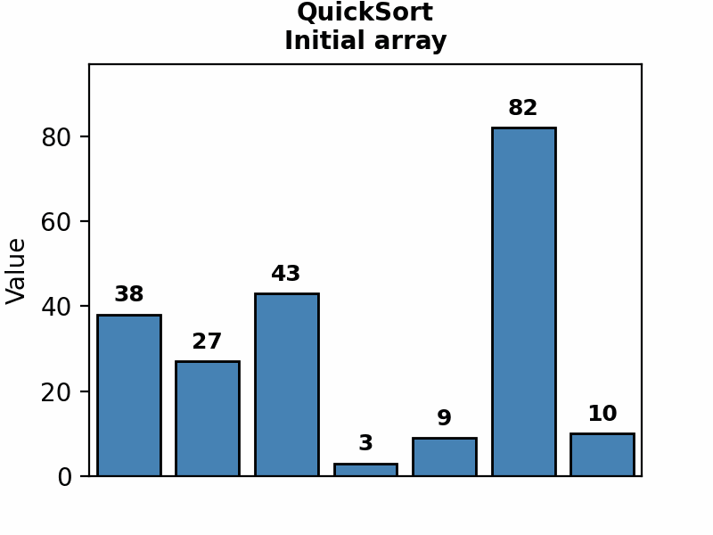
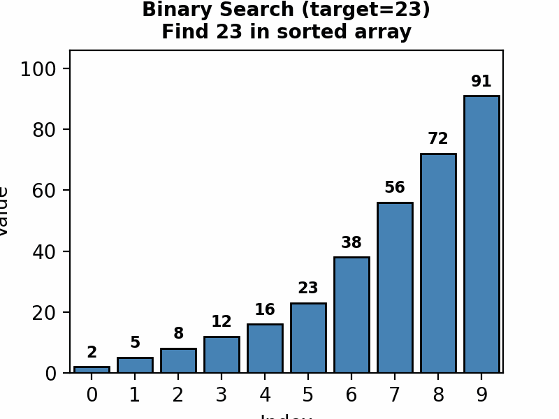
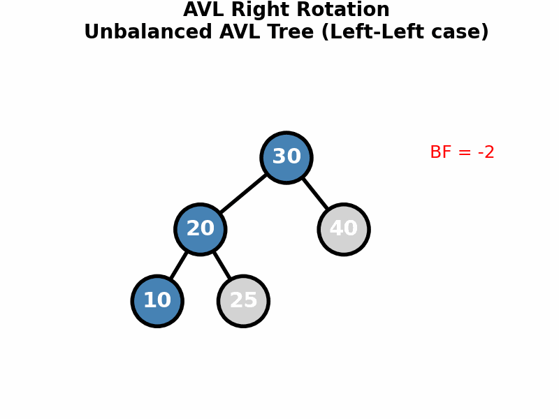
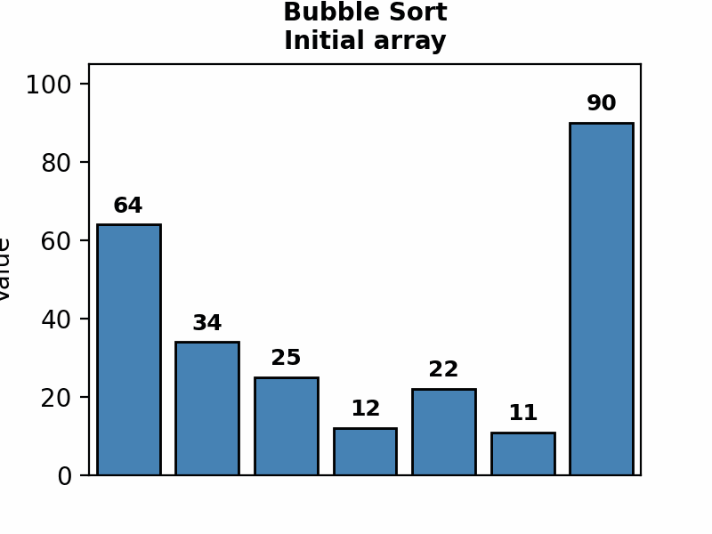
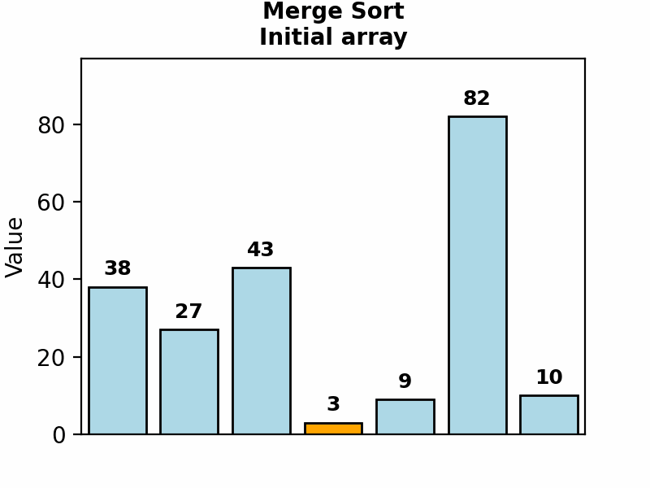
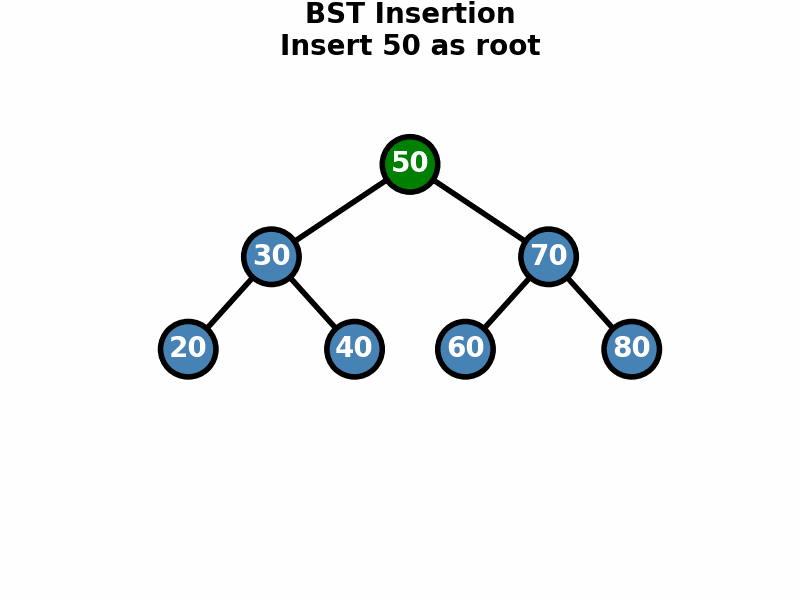
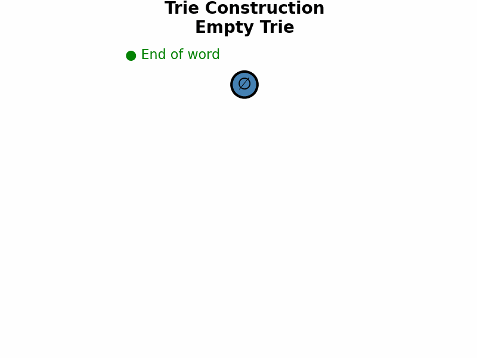

# 🎓 Algorithms & Data Structures


A comprehensive course covering fundamental algorithms and data structures with visual explanations, ASCII art diagrams, and working Python implementations.

---

### 🎬 Algorithm Visualizations

| Animation | Description |
|:---------:|:------------|
|  | **QuickSort** — A divide-and-conquer sorting algorithm. The red element marks the **pivot**, and elements are partitioned around it. Orange highlights the current comparison. Average time complexity: O(n log n). |
|  | **Binary Search** — Efficiently finds a target in a sorted array by repeatedly halving the search space. The green marker shows the current midpoint being checked. Time complexity: O(log n). |
|  | **AVL Tree Rotations** — Self-balancing binary search tree that maintains height balance using rotations (LL, RR, LR, RL). Watch how the tree restructures after insertions to keep operations at O(log n). |

---

## 📑 Table of Contents

- [Course Overview](#-course-overview)
- [Course Map](#-course-map)
- [Modules](#-modules)
  - [Module 1: Fundamentals](#-module-1-fundamentals)
  - [Module 2: Sorting Algorithms](#-module-2-sorting-algorithms)
  - [Module 3: Searching Algorithms](#-module-3-searching-algorithms)
  - [Module 4: Linear Data Structures](#-module-4-linear-data-structures)
  - [Module 5: Trees](#-module-5-trees)
  - [Module 6: Hash-Based Structures](#-module-6-hash-based-structures)
  - [Module 7: String Algorithms](#-module-7-string-algorithms)
  - [Module 8: Advanced String Structures](#-module-8-advanced-string-structures)
- [Quick Reference Table](#-quick-reference-table)
- [Prerequisites](#-prerequisites)
- [Getting Started](#-getting-started)
- [Learning Path](#-learning-path)
- [Contributing](#-contributing)
- [License](#-license)

---

## 🎯 Course Overview

This repository contains a complete curriculum for mastering algorithms and data structures, designed for computer science students and software engineers preparing for technical interviews.

### Learning Objectives

By completing this course, you will be able to:

- ✅ Analyze algorithm complexity using Big-O notation
- ✅ Implement and compare various sorting and searching algorithms
- ✅ Build and manipulate fundamental data structures
- ✅ Apply tree-based structures for efficient data organization
- ✅ Utilize hash tables for O(1) average-case operations
- ✅ Master string matching algorithms and advanced text processing
- ✅ Choose the right algorithm for specific problem constraints

---

## 🗺️ Course Map

```
┌─────────────────────────────────────────────────────────────────────────────────┐
│                           ALGORITHMS & DATA STRUCTURES                          │
└─────────────────────────────────────────────────────────────────────────────────┘
                                        │
        ┌───────────────────────────────┼───────────────────────────────┐
        │                               │                               │
        ▼                               ▼                               ▼
┌───────────────┐             ┌───────────────┐             ┌───────────────┐
│ FUNDAMENTALS  │────────────▶│    SORTING    │────────────▶│  SEARCHING    │
│               │             │               │             │               │
│ • Complexity  │             │ • Comparison  │             │ • Linear      │
│ • Big-O       │             │ • Linear      │             │ • Binary      │
└───────────────┘             └───────────────┘             └───────────────┘
                                        │
                                        ▼
┌───────────────┐             ┌───────────────┐             ┌───────────────┐
│    LINEAR     │◀────────────│     TREES     │────────────▶│  HASH-BASED   │
│  STRUCTURES   │             │               │             │  STRUCTURES   │
│               │             │ • BST         │             │               │
│ • Lists       │             │ • AVL         │             │ • Hash Tables │
│ • Stacks      │             │ • Red-Black   │             │ • Bloom Filter│
│ • Queues      │             └───────────────┘             └───────────────┘
└───────────────┘                     │
                                      ▼
                    ┌───────────────────────────────┐
                    │         STRING ALGORITHMS      │
                    │                               │
                    │  • Pattern Matching (KMP, RK) │
                    │  • Tries & Suffix Structures  │
                    └───────────────────────────────┘
```

---

## 📚 Modules

### 📐 Module 1: Fundamentals

Build a solid foundation in algorithm analysis and basic computational thinking.

**Topics:**
- Asymptotic notation (Big-O, Big-Ω, Big-Θ)
- Time and space complexity analysis
- Best, average, and worst case scenarios
- Recursion and recurrence relations
- Basic algorithmic paradigms

📁 **Notebooks:** [01-complexity-analysis](01-Fundamentals/01-complexity-analysis.ipynb) | [02-basic-algorithms](01-Fundamentals/02-basic-algorithms.ipynb)

---

### 📊 Module 2: Sorting Algorithms

Master the art of organizing data efficiently with a variety of sorting techniques.

| Animation | Description |
|:---------:|:------------|
|  | **Bubble Sort** — Repeatedly compares adjacent elements and swaps them if they're in the wrong order. Red and orange highlight the pair being compared. Simple but inefficient: O(n²). |
|  | **Merge Sort** — Divides the array in half recursively, then merges sorted halves back together. A stable, divide-and-conquer algorithm with guaranteed O(n log n) performance. |

**Topics:**
- **Comparison Sorts:** Bubble Sort, Selection Sort, Insertion Sort, Merge Sort, Shell Sort, QuickSort
- **Linear Sorts:** Counting Sort, Radix Sort, Bucket Sort
- Stability analysis and in-place sorting
- Complexity comparisons and use cases

📁 **Notebooks:** [01-comparison-sorts](02-Sorting/01-comparison-sorts.ipynb) | [02-linear-sorts](02-Sorting/02-linear-sorts.ipynb)

---

### 🔍 Module 3: Searching Algorithms

Learn efficient techniques to find elements in various data structures.

| Animation | Description |
|:---------:|:------------|
|  | **Binary Search** — Locates a target value by comparing it to the middle element and eliminating half of the remaining elements each step. Requires sorted input. Time complexity: O(log n). |

**Topics:**
- Linear (Sequential) Search
- Binary Search and its variants
- Interpolation Search
- Search in rotated arrays
- Two-pointer techniques

📁 **Notebooks:** [01-linear-binary-search](03-Searching/01-linear-binary-search.ipynb)

---

### 🔗 Module 4: Linear Data Structures

Implement and understand fundamental building blocks of computer science.

**Topics:**
- **Linked Lists:** Singly, Doubly, Circular linked lists
- **Stacks:** LIFO operations, applications (expression evaluation, backtracking)
- **Queues:** FIFO operations, circular queues, deques, priority queues
- **Dynamic Arrays:** Amortized analysis, growth strategies

📁 **Notebooks:** [01-linked-lists](04-Linear-Data-Structures/01-linked-lists.ipynb) | [02-stacks-queues](04-Linear-Data-Structures/02-stacks-queues.ipynb) | [03-dynamic-arrays](04-Linear-Data-Structures/03-dynamic-arrays.ipynb)

---

### 🌳 Module 5: Trees

Explore hierarchical data structures essential for efficient data organization.

| Animation | Description |
|:---------:|:------------|
|  | **BST Insertion** — New nodes are placed by comparing with each node: go left if smaller, right if larger, until finding an empty spot. Average O(log n), but can degrade to O(n) if unbalanced. |
|  | **AVL Rotations** — After each insertion, the tree checks balance factors and performs rotations to maintain height balance, ensuring all operations stay at O(log n). |

**Topics:**
- **Binary Search Trees (BST):** Insert, delete, search, traversals
- **AVL Trees:** Self-balancing, rotations (LL, RR, LR, RL)
- **Red-Black Trees:** Properties, insertion, deletion
- Tree traversals (inorder, preorder, postorder, level-order)
- Applications and performance comparisons

📁 **Notebooks:** [01-binary-search-trees](05-Trees/01-binary-search-trees.ipynb) | [02-avl-trees](05-Trees/02-avl-trees.ipynb) | [03-red-black-trees](05-Trees/03-red-black-trees.ipynb)

---

### 🗄️ Module 6: Hash-Based Structures

Achieve constant-time operations with hash-based data structures.

**Topics:**
- Hash functions and collision resolution
- Chaining vs Open Addressing (Linear Probing, Quadratic Probing, Double Hashing)
- Load factor and rehashing
- **Bloom Filters:** Probabilistic data structures
- Hash maps and hash sets implementation

📁 **Notebooks:** [01-hash-tables-bloom](06-Hash-Based-Structures/01-hash-tables-bloom.ipynb)

---

### 🔤 Module 7: String Algorithms

Master efficient text processing and pattern matching techniques.

**Topics:**
- **Naive Pattern Matching:** Brute force approach
- **KMP Algorithm:** Failure function and linear-time matching
- **Rabin-Karp:** Rolling hash for multiple pattern matching
- **DFA Matching:** Deterministic finite automata approach
- String preprocessing techniques

📁 **Notebooks:** [01-naive-pattern-matching](07-String-Algorithms/01-naive-pattern-matching.ipynb) | [02-kmp-algorithm](07-String-Algorithms/02-kmp-algorithm.ipynb) | [03-rabin-karp](07-String-Algorithms/03-rabin-karp.ipynb) | [04-dfa-matching](07-String-Algorithms/04-dfa-matching.ipynb)

---

### 🧬 Module 8: Advanced String Structures

Dive into sophisticated data structures for complex string operations.

| Animation | Description |
|:---------:|:------------|
|  | **Trie Construction** — A prefix tree that stores strings character by character. Each path from root to a green node (end marker) represents a stored word. Enables O(m) search where m is the word length. |

**Topics:**
- **Tries:** Prefix trees, autocomplete, spell checking
- **Aho-Corasick:** Multi-pattern matching automaton
- **Suffix Arrays:** Space-efficient suffix structures, LCP arrays
- **Suffix Trees:** Ukkonen's algorithm, applications
- Pattern matching in DNA sequences and text editors

📁 **Notebooks:** [01-tries](08-Advanced-String-Structures/01-tries.ipynb) | [02-aho-corasick](08-Advanced-String-Structures/02-aho-corasick.ipynb) | [03-suffix-arrays](08-Advanced-String-Structures/03-suffix-arrays.ipynb) | [04-suffix-trees](08-Advanced-String-Structures/04-suffix-trees.ipynb)

---

## 📋 Quick Reference Table

### Sorting Algorithms

| Algorithm | Time (Best) | Time (Avg) | Time (Worst) | Space | Stable | In-Place |
|-----------|:-----------:|:----------:|:------------:|:-----:|:------:|:--------:|
| Bubble Sort | O(n) | O(n²) | O(n²) | O(1) | ✅ | ✅ |
| Selection Sort | O(n²) | O(n²) | O(n²) | O(1) | ❌ | ✅ |
| Insertion Sort | O(n) | O(n²) | O(n²) | O(1) | ✅ | ✅ |
| Merge Sort | O(n log n) | O(n log n) | O(n log n) | O(n) | ✅ | ❌ |
| QuickSort | O(n log n) | O(n log n) | O(n²) | O(log n) | ❌ | ✅ |
| Shell Sort | O(n log n) | O(n^1.25) | O(n²) | O(1) | ❌ | ✅ |
| Counting Sort | O(n + k) | O(n + k) | O(n + k) | O(k) | ✅ | ❌ |
| Radix Sort | O(nk) | O(nk) | O(nk) | O(n + k) | ✅ | ❌ |
| Bucket Sort | O(n + k) | O(n + k) | O(n²) | O(n) | ✅ | ❌ |

### Searching Algorithms

| Algorithm | Time (Best) | Time (Avg) | Time (Worst) | Space | Requirement |
|-----------|:-----------:|:----------:|:------------:|:-----:|:-----------:|
| Linear Search | O(1) | O(n) | O(n) | O(1) | None |
| Binary Search | O(1) | O(log n) | O(log n) | O(1) | Sorted array |
| Interpolation Search | O(1) | O(log log n) | O(n) | O(1) | Sorted, uniform |

### Data Structures

| Structure | Access | Search | Insert | Delete | Space |
|-----------|:------:|:------:|:------:|:------:|:-----:|
| Array | O(1) | O(n) | O(n) | O(n) | O(n) |
| Linked List | O(n) | O(n) | O(1) | O(1) | O(n) |
| Stack | O(n) | O(n) | O(1) | O(1) | O(n) |
| Queue | O(n) | O(n) | O(1) | O(1) | O(n) |
| Hash Table | N/A | O(1)* | O(1)* | O(1)* | O(n) |
| BST | O(log n)* | O(log n)* | O(log n)* | O(log n)* | O(n) |
| AVL Tree | O(log n) | O(log n) | O(log n) | O(log n) | O(n) |
| Red-Black Tree | O(log n) | O(log n) | O(log n) | O(log n) | O(n) |

*\* Average case; worst case may differ*

### String Algorithms

| Algorithm | Preprocessing | Matching | Space | Use Case |
|-----------|:-------------:|:--------:|:-----:|:--------:|
| Naive | O(1) | O(mn) | O(1) | Simple, short patterns |
| KMP | O(m) | O(n) | O(m) | Single pattern |
| Rabin-Karp | O(m) | O(n)* | O(1) | Multiple patterns |
| DFA | O(mΣ) | O(n) | O(mΣ) | Repeated searches |
| Aho-Corasick | O(mk) | O(n + z) | O(mk) | Multiple patterns |

*Where n = text length, m = pattern length, Σ = alphabet size, k = number of patterns, z = matches*

---

## 📋 Prerequisites

Before starting this course, you should be familiar with:

- **Python 3.8+** — Basic syntax, functions, classes, and modules
- **Basic Mathematics** — Logarithms, exponents, summations
- **Jupyter Notebooks** — Running and modifying notebook cells
- **Git** — Basic version control (clone, pull)

### Recommended Background

- Basic understanding of recursion
- Familiarity with at least one programming language
- High school level mathematics

---

## 🚀 Getting Started

### 1. Clone the Repository

```bash
git clone https://github.com/yourusername/Algorithms.git
cd Algorithms
```

### 2. Set Up Environment (Optional)

```bash
# Create virtual environment
python -m venv venv
source venv/bin/activate  # On Windows: venv\Scripts\activate

# Install dependencies
pip install jupyter numpy matplotlib
```

### 3. Launch Jupyter

```bash
jupyter notebook
```

### 4. Start Learning!

Navigate to `01-Fundamentals/` and open the first notebook.

---

## 🛤️ Learning Path

### Recommended Study Order

```
Week 1-2    ──▶  Module 1: Fundamentals
                 └── Master complexity analysis before anything else

Week 3-4    ──▶  Module 2: Sorting
                 └── Implement each algorithm from scratch

Week 5      ──▶  Module 3: Searching
                 └── Focus on binary search variations

Week 6-7    ──▶  Module 4: Linear Data Structures
                 └── Build your own implementations

Week 8-9    ──▶  Module 5: Trees
                 └── Practice rotations until they're intuitive

Week 10     ──▶  Module 6: Hash-Based Structures
                 └── Understand collision resolution deeply

Week 11-12  ──▶  Module 7: String Algorithms
                 └── Trace through examples by hand

Week 13-14  ──▶  Module 8: Advanced String Structures
                 └── Challenge yourself with applications
```

### Tips for Success

1. **Code from scratch** — Don't just read; implement everything yourself
2. **Trace by hand** — Walk through algorithms with pen and paper
3. **Analyze complexity** — Always determine Big-O before moving on
4. **Test edge cases** — Empty inputs, single elements, duplicates
5. **Compare approaches** — Understand when to use which algorithm

---

## 🤝 Contributing

Contributions are welcome! Here's how you can help:

### Ways to Contribute

- 🐛 **Bug Reports** — Found an error? Open an issue
- 📝 **Documentation** — Improve explanations or add examples
- 💡 **New Content** — Suggest additional algorithms or topics
- 🎨 **Visualizations** — Create GIFs or diagrams

### Contribution Guidelines

1. Fork the repository
2. Create a feature branch (`git checkout -b feature/amazing-addition`)
3. Make your changes
4. Run all notebooks to ensure they work
5. Commit with clear messages (`git commit -m 'Add heap sort implementation'`)
6. Push to your branch (`git push origin feature/amazing-addition`)
7. Open a Pull Request

### Code Style

- Follow PEP 8 for Python code
- Include docstrings for all functions
- Add complexity analysis in comments
- Keep cells focused and well-documented

---

## 📄 License

This project is licensed under the MIT License — see the [LICENSE](LICENSE) file for details.

```
MIT License

Copyright (c) 2024

Permission is hereby granted, free of charge, to any person obtaining a copy
of this software and associated documentation files (the "Software"), to deal
in the Software without restriction, including without limitation the rights
to use, copy, modify, merge, publish, distribute, sublicense, and/or sell
copies of the Software...
```

---

<p align="center">
  <b>Happy Learning! 🚀</b>
  <br><br>
  <i>If you find this repository helpful, please consider giving it a ⭐</i>
</p>
